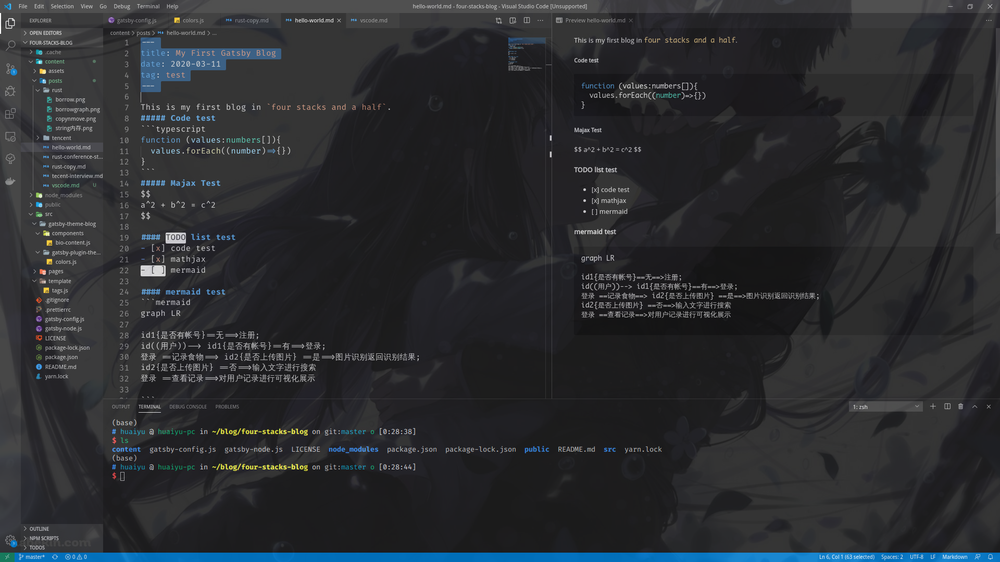
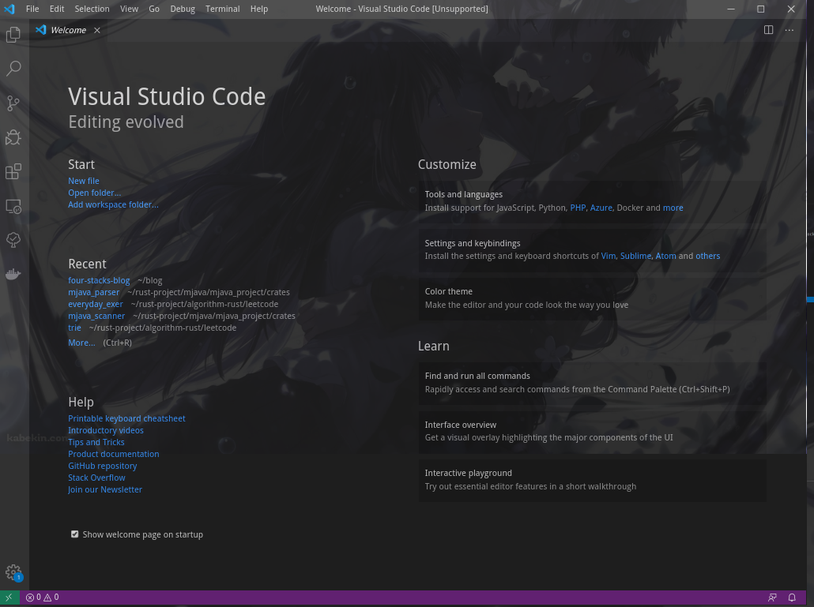

+++
title= "Add a image background for your vscode"
date=2020-04-01
tags=["vscode"]
+++
为你的vscode添加一个图片背景吧!

#### 先看一个效果展示～




#### 方法
为了可随时修改，你可以在你的`~/.vscode`文件夹下创建一个`vscode_style`的目录，
在里边放入你自己的css文档和一些图片。以笔者为例,我的vscode的sytle是
```css
/**vscode_style.css*/
body{
   pointer-events: auto !important;
   background-size: 100% !important;
   opacity: 0.90 !important;
   background-position: 0 0 !important;
   /**change your image url here*/
   background-image: url('./bg.png');
   content: '';
   position: absolute;;
   z-index: 999;
   width: 100%;
   background-repeat: no-repeat;
 }
```

然后找到vscode程序文件夹，linux上一般在`'/opt'`目录下。在`{vscode_dir}/resources/app/out/vs/workbench`下修改`workbench.desktop.main.css`就可以修改vscode的样式啦。
```css
@import "/home/huaiyu/.vscode/vscode_style/vscode_style.css";
```
重启vscode就好了,当你重启后发现vscode提醒你`your code installation appears to be corrupt`,直接忽略就它~
- 另，如果觉得丑丑的title bar不好看，可以在settings.json添加
```json
"window.titleBarStyle": "custom",
```
可以自己定制标题栏的样式。